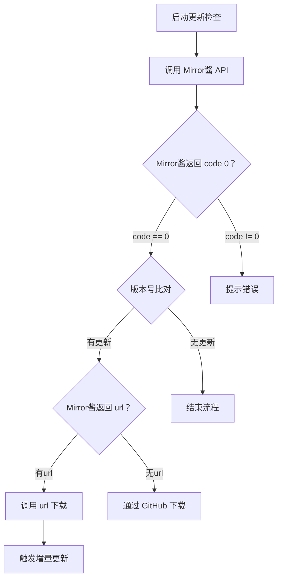

# Mirror酱服务集成指南

## API 接口

### 接口基础信息

- **服务端点**：`GET` `https://mirrorchyan.com/api/resources/{res_id}/latest`
- **接口文档**：[OpenAPI](https://apifox.com/apidoc/shared-ffdc8453-597d-4ba6-bd3c-5e375c10c789/253583257e0)

### 请求参数说明

| 参数名称          | 类型     | 必填 | 描述                                                                 |
|--------------------|----------|------|----------------------------------------------------------------------|
| res_id             | path     | 是   | 资源标识符，请联系技术支持获取     |
| current_version    | query    | 推荐 | 当前本地资源版本号（推荐遵循 SemVer 规范）                               |
| cdk                | query    | 否   | 用户激活密钥                                   |
| user_agent         | query    | 否   | 客户端标识，可用于营收统计来源          |

[完整请求参数](https://apifox.com/apidoc/shared-ffdc8453-597d-4ba6-bd3c-5e375c10c789/253583257e0)

### 调用示例

```bash
curl -X GET "https://mirrorchyan.com/api/resources/M9A/latest?current_version=v0.0.1&cdk=XXXXX&user_agent=MAA_WPF"
```

### 响应数据结构

#### 成功响应示例（主要字段）

```json
{
  "code": 0,
  "msg": "success",
  "data": {
    "version_name": "v1.1.0",
    "url": "https://mirrorchyan.com/resources/download/xxxxxx",
    "release_note": "该版本新增了xxx功能；修复了xxx bug"
  }
}
```

##### 字段说明

- **version_name**: 最新版本号（始终返回）
- **url**: 带时效的下载地址（有新版本且CDK有效时返回）
- **release_note**: 版本日志（有新版本时返回）

[完整响应字段](https://apifox.com/apidoc/shared-ffdc8453-597d-4ba6-bd3c-5e375c10c789/253583257e0)

#### 失败响应

请参考 [错误代码表](./ErrorCode.md)

## 集成流程指南

_集成流程仅为推荐做法，供您参考，非强制要求，具体的文案及行为请根据项目实际调整_

### 前置条件配置

1. 在客户端设置中添加：
   - CDK 输入文本框
   - 网页跳转链接：`[Mirror酱](https://mirrorchyan.com)`

*请考虑日志、配置文件等中，尽量不要出现 CDK 明文，避免意外泄漏。*

### 检查更新流程

Mirror酱 API 在中国大陆和海外都有良好的连通性，推荐即使未填写 CDK 时也使用 Mirror酱 API 检查，以更高效获取更新消息。



### 增量更新流程

1. 解压更新包
2. 若存在 `changes.json`，请参考 [增量包内容](./Incremental.md) 中 `deleted` 字段，删除不再需要的文件
3. 覆盖文件（Tips: 若待更新程序本身正在运行，可先将其重命名并再下次启动再删除。即重命名是不依赖程序是否未被占用的）

## 自动化上传

我们会为您 PR 定制化的 CI/CD 解决方案，在每次版本发布/新提交推送时全自动上传，具体方案请与我们联系~

## 联系我们

集成开发 QQ 群：1026040805  
用户售后 QQ 群：995458883
